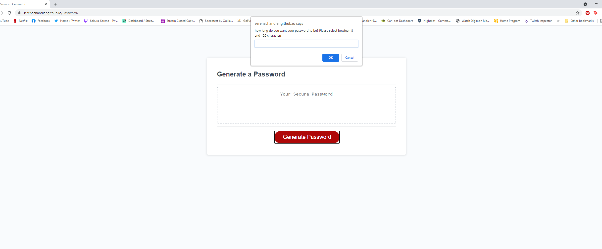

# Homeward Assignment 3: password generator


## Summary of assignment

for this assignment we were tasked with making a password generator. 

## languages used
- Html - this was given to us, made up the main elemnts of the page
- CSS - this was given to us, was not edited
- Javascript - used to give funtionality to existing page elements and take in user input

## preview of the application



## code snippet (how the funtion takes in and responds to user input)
```Javascript
    
function writePassword() {
  finalArray = []
  function generatePassword() { 
    length = 0
    while (length < 8 || length >128) {
    var length = prompt("how long do you want your password to be? Please select bewteen 8 and 120 characters")
    if (length < 8 || length > 128 ) {
      window.alert("please enter a number between 8 and 120")
    }
    }

    
    var special = specials()
    var number = numbers()
    var letter = letters()
    var upper = Uppers()

    while (finalArray.length < length) {
      if (special == "yes") {
        finalArray.unshift(specialArray[Math.floor(Math.random()*10)])
      }if (number == "yes") {
        finalArray.unshift(numberArray[Math.floor(Math.random()*10)])
      }if (letter == "yes") {
        finalArray.unshift(letterArray[Math.floor(Math.random()*10)])
      }if (upper == "yes") {
        finalArray.unshift(upperLetterArray[Math.floor(Math.random()*10)])
      }
    }
    

    
    finalArray.length = length
    finalArrayString = finalArray.join("")
  return finalArrayString}
```
## My Links
[Github](https://github.com/SerenaChandler)